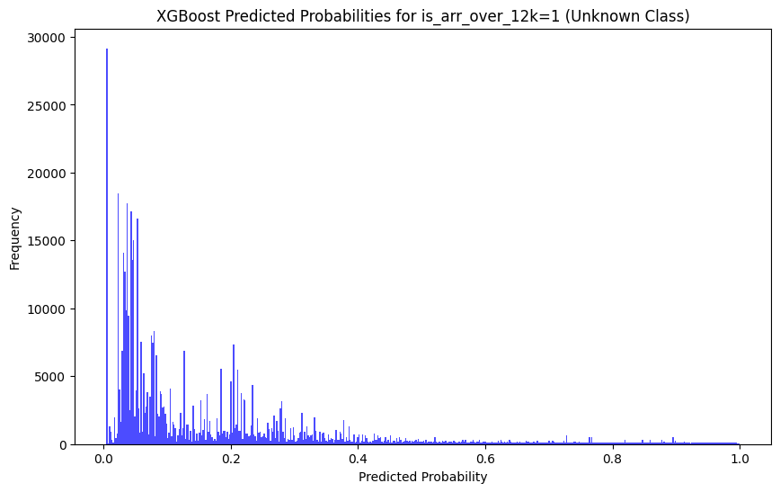
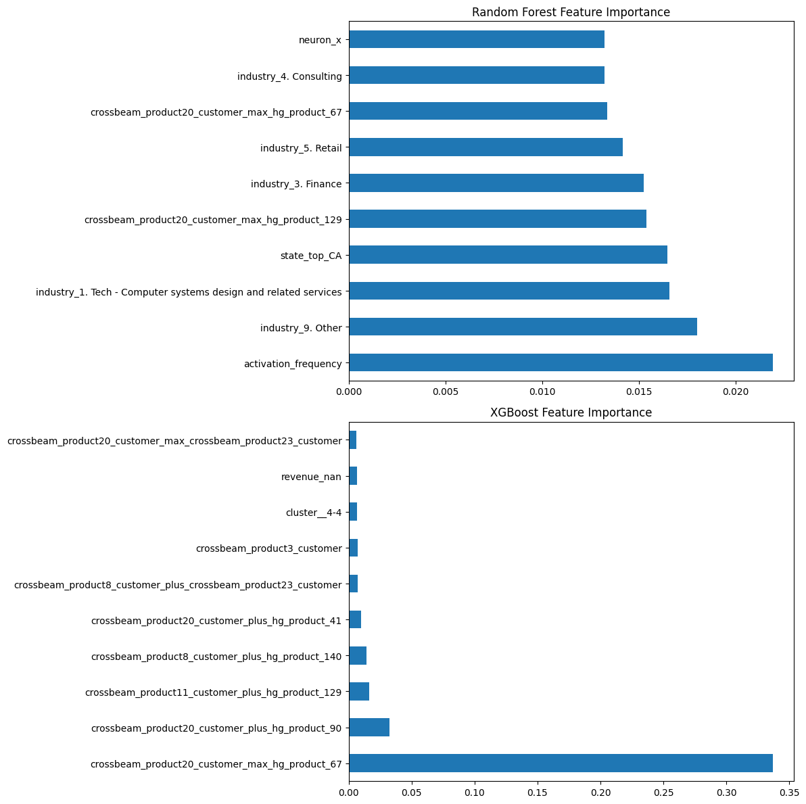

# Five_twelve Lead Modeling

> [!NOTE]  
> Parts of this have been borrrowed from my own [lecture notes](http://not.badmath.org/seminar-classify)

## Objective

Identifying potential leads for targeting next year with an annual payment over $12,000

**Prompt:**

> As mentioned, the question we are trying to answer is, how to select accounts who are not yet customers, that we should target next year.  We are interested in customers who pay more than 12K per year (you'll see a relevant column in the dictionary tab).
> 
> The more technical/mathematical (code is fine) you can be with your analysis, the better.  Less slides with complex words, and more juice.

# Results

Winner based on F1 Score: **XGBoost**

XGBoost performed best on F1 Score, Accuracy, and Precision while coming in a close second on Recall and specificity. (See below for definitions and business impact of different evaluation criteria)

## Evaluation Metrics

| Model               |   Accuracy |   Precision |   Recall |   Specificity | F1 Score |
|:--------------------|-----------:|------------:|---------:|--------------:|---------:|
| XGBoost             |   0.75     |    0.707547 | 0.589391 |      0.849332 | 0.643087 |
| Random Forest       |   0.724474 |    0.646091 | 0.616896 |      0.791009 | 0.631156 |
| Lasso               |   0.74024  |    0.70529  | 0.550098 |      0.857837 | 0.618102 |
| Logistic Regression |   0.733483 |    0.674208 | 0.585462 |      0.82503  | 0.626709 |
| Gradient Boosting   |   0.742492 |    0.696682 | 0.577603 |      0.844471 | 0.631579 |

## Top 5 Account IDs

Top 5 Account IDs with Highest Predicted Probabilities for is_arr_over_12k=1 (Unknown Class):
| Account ID         |   Predicted Probability |
|:-------------------|------------------------:|
| 0011G00000qE5cdQAC |                0.999728 |
| 0011G00000tM2osQAC |                0.999718 |
| 0011G00000f9KamQAE |                0.999638 |
| 0011G00000qeg53QAA |                0.99946  |
| 0011G00000gY3rPQAS |                0.999416 |

Predicted Probability threshold for the top 2000 accounts: 0.9582011

## Important Features

The most important features in the model are:

 - Industry
 - Location (esp. California)
 - Derived features from combinations of products
 - Derived features from the self-organizing map

Trees such as XGBoost may have complicated relationships between model inputs and outputs, so to get a general sense of the directional influence of a variable we may look to the Logistic Regression. SHapley Additive exPlanations (SHAP) would give more detail, but take too long to run for this exercise.

Top 10 Features and Association for Logistic Regression:
| Feature             |   Coefficient |
|:--------------------|--------------:|
| state_top_Missing   |    -0.254647  |
| revenue_nan         |    -0.157121  |
| bmu_y               |     0.142434  |
| neuron_y            |     0.142434  |
| neuron_x            |    -0.141452  |
| bmu_x               |    -0.141452  |
| country_top_US      |     0.124906  |
| country_top_Other   |    -0.113162  |
| activation_distance |     0.088013  |
| industry_nan        |    -0.0787086 |

# Limitations

## Outcome Variable

The data consisted of customers and non-customer potential leads. Customers had a boolean variable `is_arr_over_12k` with True/False values, for non-customers this variable was missing. Most notably, this means that **this data can not be used to model conversion** without additional information.

Another variable, `is_self_service`, was highly negatively correlated (R^2=0.688) with `is_arr_over_12k`. While interesting, this cannot be used as a predictor as it is unknown until a lead becomes a customer. It could be interesting to investigate this further, but was not used in this exercise.

## Sample Size

The data included 8879 customers (3417 above 12k ARR, 5462 below) and 500720 non-customers. The high- vs low-ARR classes are close enough to being balanced that training models only on customer data could be fruitful. Using models based on 2% of the data to predict outcomes on the other 98% could run into issues, such as selection bias on latent variables.

Approaches that could be taken to alleviate this include:
 - **Extrapolation:** Identify patterns in the non-customers to class some of them as-if they were actually high or low ARR
 - **Reinforcement:** Incorporate a feedback loop with subject matter experts (e.g., sales) on incorrect model outputs (note: this would likely require a complex model, such as a neural network)
 - **Synthetic Data:** Use existing customer data to generate additional "synthetic customers" that don't actually exist

 Each of these methods should be considered carefully before implementing, as they could introduce bias and overfitting.

## Enrichment Data

Enrichment data is missing for the majority of non-customers, but present for almost 90% of customers. In my experience, lack of enrichment data is generally indicative of smaller companies or very new ones. As such, data can only support focusing on companies with enrichment data available.

 - **Strategic Focus on Companies with Enrichment:**
    > It makes sense to focus on companies with available enrichment data, as it not only aligns with your model training but also reflects a potential business strategy to target companies with more established profiles. 
 - **Impact on Model Outputs:** 
    > Data modeling cannot make determinations on non-enriched companies as the customer data used in training is overwhelmingly enriched.

**Since the model was trained on customer data, this effect is likely underplayed in the model outputs.**

# Decisions & Trade-offs

## Evaluation Criteria

The chosen evaluation criteria is the **F1 Score**, striking a Goldilocks balance between identifying high ARR customers (whales) and avoiding unnecessary engagement with low ARR prospects (minnows). 

Here's a breakdown of other evaluation criteria, some of are used in calculating the F1 Score:

- **Recall** (Sensitivity, True Positive Rate) = $\frac{TP}{TP+FN}$
    
    > *How well it captures actual positives (don't miss the whales)*
    
- **Miss Rate** (False Negative Rate) = $\frac{FN}{TP + FN}$
    
    > *Proportion of positives incorrectly classified, particularly relevant when missing a positive has a high cost*
    
- **Specificity** (Selectivity, True Negative Rate) = $\frac{TN}{TN + FP}$
    
    > *Similar to Recall, gauging performance among actual negatives (keep out the minnows)*
    
- **Precision** (Positive Predictive Value) = $\frac{TP}{TP + FP}$
    
    > *Assessment of performance when predicting positive outcomes (are the whales actually whales?)*
    
- **F1 score** = 2(Recall * Precision)/(Recall + Precision)
    
    > *Balanced score for overall model performance, considering both precision and recall (leads not too hot, not too cold)*
    
- **Receiver-Operator Curve (ROC Curve) and Area Under the Curve (AUC)**
    
    > *Plotting True Positive vs. False Positive rates, providing a scale-invariant measure of performance. A random model scores 0.5, while a perfect model always scores 1*
    

## Candidate Models

Models were selected for inclusion based upon appropriateness for the variables included, interpretability of results, proof of utility in industry, and speed of implementation.

The models included were:
 - **Logistic Regression**: "Old reliable" - a simple and interpretable baseline
 - **LASSO Regression (CV)**: Version of regression capable of utilizing multiple sparse variables
 - **Random Forest**: Highly interpretable ensemble method capable of capturing complex relationship
 - **Boosted Trees: XGBoost & LightGBM**: Ensemble methods capable of drilling into poor-performing classes

## Cross-validation of Models

Cut for time in this exercise, repeatedly training and evaluating model on random subsets of data would help in the following areas:

 - **Robustness of Model Evaluation:**
    > When evaluating the model, especially on metrics like F1 Score, the limited number of positive instances may lead to a higher variance in performance metrics. Ensuring the model's robustness across different data subsets becomes crucial, and variations in evaluation scores should be interpreted with caution.
 - **Potential for Overfitting:**
    > In scenarios with a small number of positive instances, there is an increased risk of overfitting, where the model might memorize the training data rather than learning underlying patterns. This could compromise the model's ability to generalize to new, unseen data

## Feature Engineering

Various feature engineering techniques were applied to enhance the model's predictive power, but it is essential to acknowledge the limitations imposed due to time constraints:

1.  **Self-Organizing Maps (SOM):**
    
    >  Variables were generated for cluster, neuron location (x, y), and distance to the centroid of `is_arr_over_12k`. While measuring to the closest neuron within the `is_arr_over_12k=True` class could provide more information, this approach would require iterating over all possible distances, resulting in a significant increase in calculations (an 8000-fold increase). Due to time constraints, a more exhaustive exploration of distances was not feasible.
2.  **Automated Feature Engineering:**
    
    >  Combinations of variable pairs were manually created to establish logical `AND` and `OR` aggregations. However, only the top 100 correlated to `is_arr_over_12k` were included in the models. An automated approach would offer a more comprehensive search through additional aggregation techniques and combinations of more than two variables, which could uncover additional patterns.
3.  **Treatment of Categorical Variables:**
    
    >  Dummy variables were created only for the top 10 most frequent values, potentially overlooking meaningful insights from less populous values. The grouping of less frequent values into a single "Other" category may have diluted their impact on the model output. However, the impact of this limitation is mitigated to some extent by the noted sample size constraints.
4.  **Treatment of Boolean Variables:**
    
    >  Boolean variables were transformed into categorical variables with three values: True, False, and Missing. This aligns with a common industry technique by coding True=1, False=-1, and Missing=0. An additional consideration could be the inclusion of a duplicate set of columns with Missing imputed as False, potentially enhancing the model's performance by making the non-customer class more similar to the `is_arr_over_12k=False` class.

It's important to note that while these limitations exist, the chosen features still contribute valuable insights to the model, and the selected techniques align with the available resources and industry practices.

# Project Flow

- Exploratory Analysis
  - Column Value Counts: Identify the distribution of values in each column
  - Autoprofile: Utilize autoprofiling via ydata-profiling
  - Autoprofile Split by Outcome/Class: Generate separate autoprofiles by 12k ARR, current customer
  - Identify Problem Variables: Identify variables with high missing values, unusual distributions, or potential data quality issues

- Feature Engineering
  - Transform: Recode categorical variables and rescale columns prior to feature eng
  - Automated Feature Engineering: Use automated feature engineering tools (e.g., Featuretools)
  - Statistical Feature Engineering: Utilize self-organizing maps to cluster w/ high ARR, clusters/scores as output columns 

- Model Selection
  - Data Splits: Split data into training, validation, and test sets
  - Evaluation Criteria: Define evaluation metrics based on business goals
  - Candidate Models: Consider logistic regression, random forests, gradient boosting, and neural networks
  - Crossfold Training: Assess model performance robustness across different data subsets
  - Feature Importance: Analyze feature importance scores from different models
  - Distribution on Unknown Class: Examine how well models generalize to the unknown class
  - Evaluate & Select Winner: Evaluate model performance on the validation set and select the best-performing model
  - Train winning candidate: 

-  Model Training
    
    -   Full Training: Train the selected model (or ensemble) on the entire training dataset
    -   Distribution on Unknown Class: Analyze model predictions on the unknown class in the test set
    -   Implementation and Upkeep: Provide recommendations on model implementation in a production environment

-   Documentation
    
    -   Write this Document: List decisions, assumptions, challenges, and the overall process
